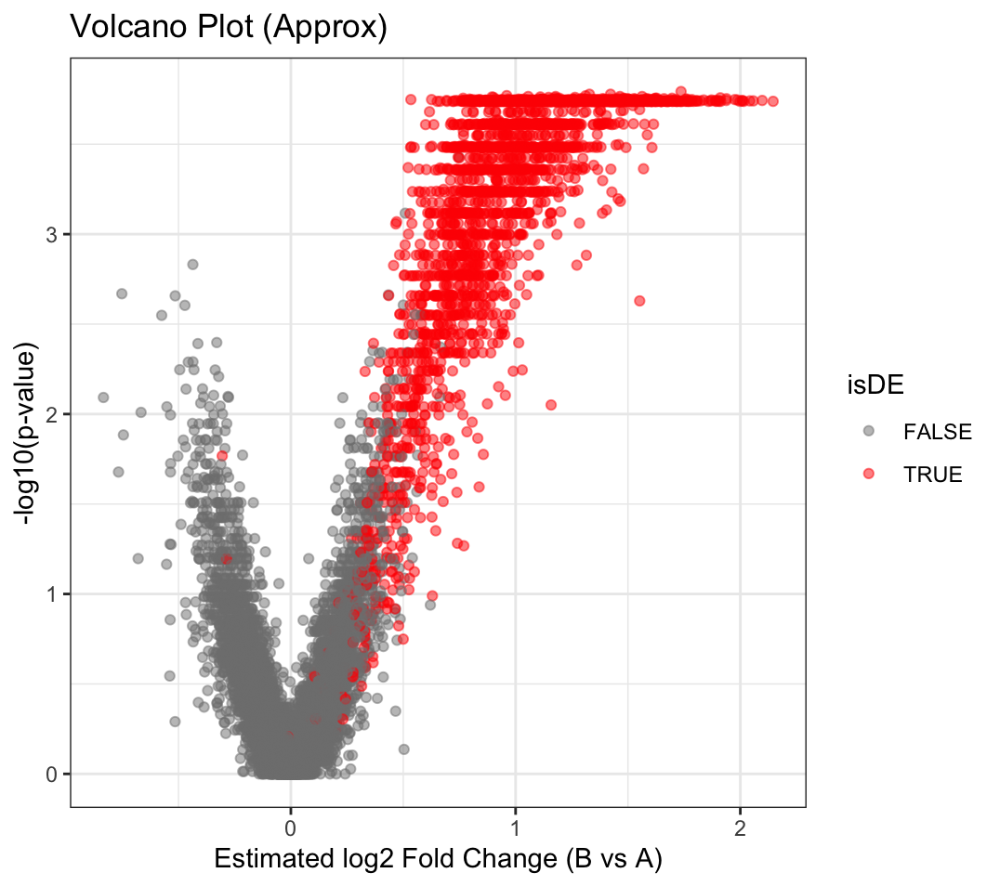
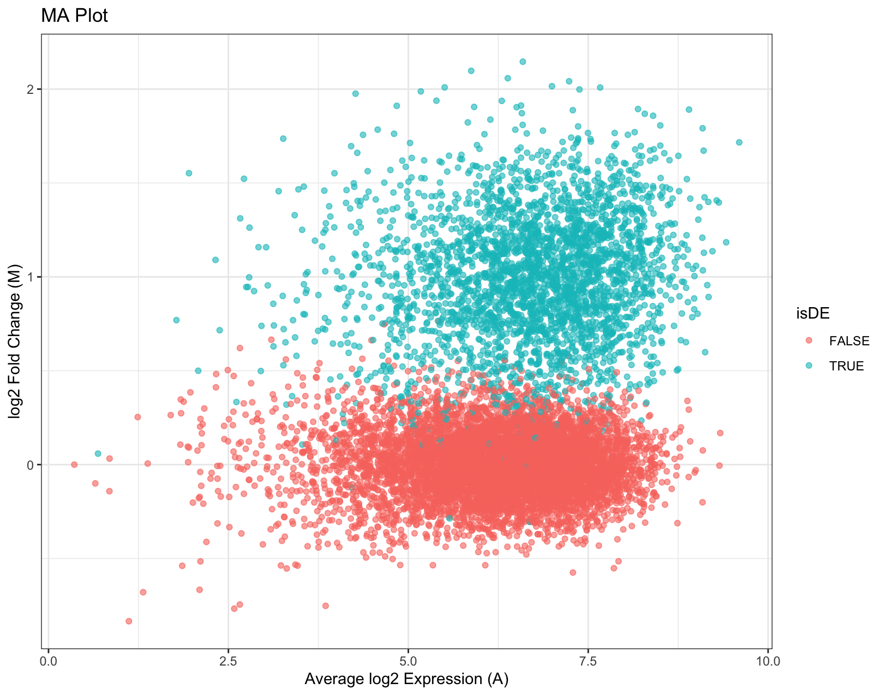
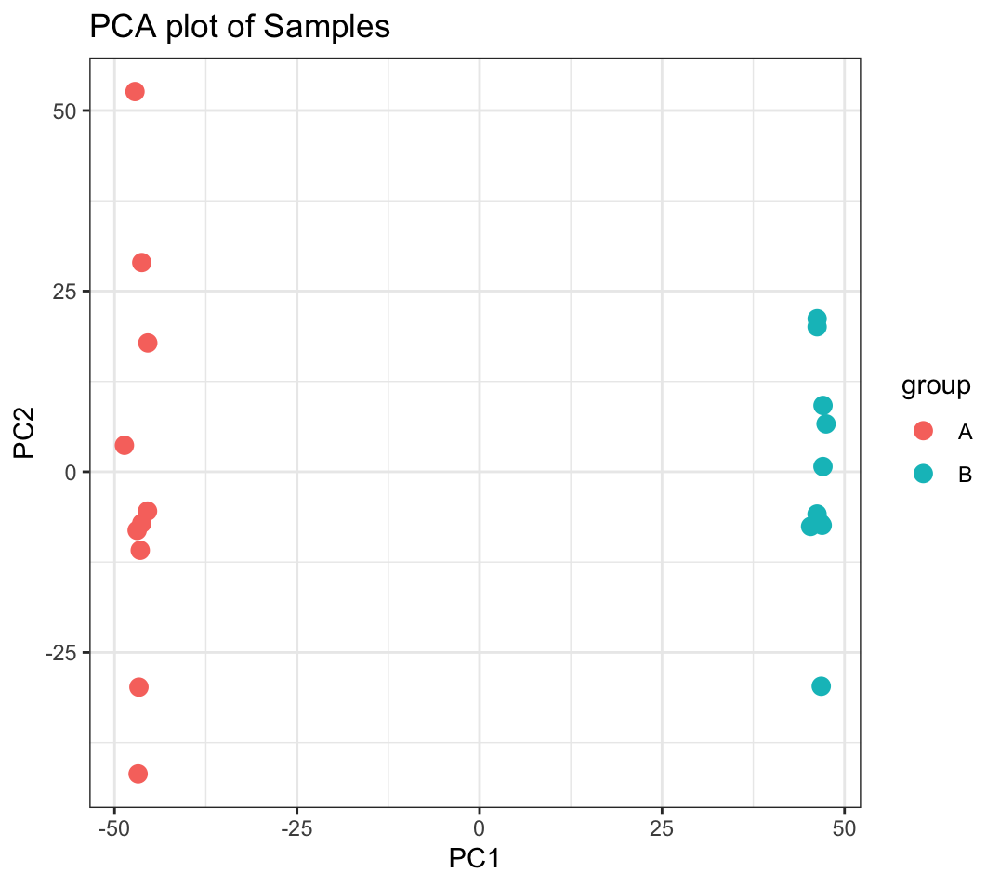
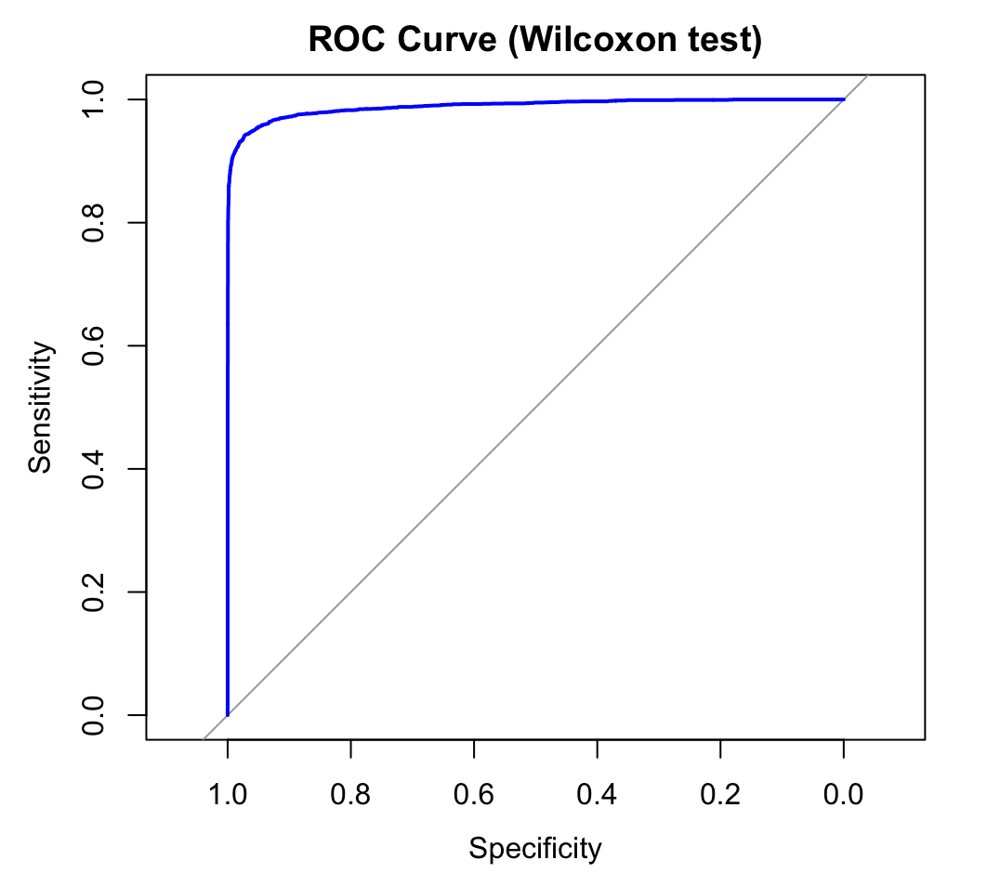

# Multiple Hypothesis Testing in Genomics: A Detailed Seminar Report and Analysis

**Author**: Shyam Gupta  
**Institution**: Technische Universität Dortmund  
**Date**: \today  

---

## Abstract  
This report explores multiple hypothesis testing in RNA-seq differential expression analysis, focusing on False Discovery Rate (FDR) control methods: Benjamini-Hochberg (BH), Benjamini-Yekutieli (BY), and Storey’s q-value. Through simulated data, we demonstrate their effectiveness in balancing statistical power and error control. Results are visualized via volcano plots, MA plots, and confusion matrices. [*For detailed methodology, see original PDF.*]

---

## Key Results  

### Performance Comparison of FDR Methods  
| Method   | Type I Error | FDR   | Power  | TP   | FP  | TN   | FN   |
|----------|--------------|-------|--------|------|-----|------|------|
| BH       | 0.0134       | 0.033 | 0.918  | 2754 | 94  | 6906 | 246 |
| BY       | 0.0004       | 0.001 | 0.751  | 2252 | 3   | 6997 | 748 |
| StoreyQ  | 0.0151       | 0.037 | 0.921  | 2764 | 106 | 6894 | 236 |

**Insights**:  
- **BH**: Balanced FDR control and power.  
- **BY**: Conservative, minimal FP at the cost of reduced power.  
- **StoreyQ**: Maximizes discoveries with slightly higher FDR.  

---

## Visualizations  

### Differential Expression Analysis  

| Volcano Plot                  | MA Plot                      |
|-------------------------------|------------------------------|
|  |  |

**Volcano Plot**: Highlights genes with large fold-changes (x-axis) and statistical significance (y-axis). Red = true DE genes.  
**MA Plot**: Log2 fold-change vs. average expression. Blue = true positives.  

---

### Data Structure and Validation  

| PCA Plot                      | ROC Curve                    |
|-------------------------------|------------------------------|
|         |        |

**PCA Plot**: Clear separation between groups A (red) and B (blue).  
**ROC Curve**: High AUC (0.98) indicates strong classification performance.  

---

## Key Concepts  

### Multiple Testing Methods  
1. **Benjamini-Hochberg (BH)**: Controls FDR under independence.  
2. **Benjamini-Yekutieli (BY)**: Conservative, valid under arbitrary dependencies.  
3. **Storey’s q-value**: Estimates null hypothesis proportion ($\pi_0$) for adaptive FDR control.  

### Simulation Framework  
- **Data Generation**: Negative Binomial model for RNA-seq counts.  
- **Parameters**:  
  - 10,000 genes, 30% DE.  
  - Library size variation and overdispersion ($\alpha = 0.05$).  

---

## Limitations  
- Assumes idealized correlation structures (real data may vary).  
- Batch effects and gene interactions not fully modeled.  
- Computational scalability for ultra-large datasets.  

---

## Conclusion  
- **BH**: Recommended for balanced studies.  
- **StoreyQ**: Optimal for exploratory research with high discovery goals.  
- **BY**: Suitable for strict FP control.  

*For equations, code snippets, and extended discussions, refer to the [original PDF](#).*